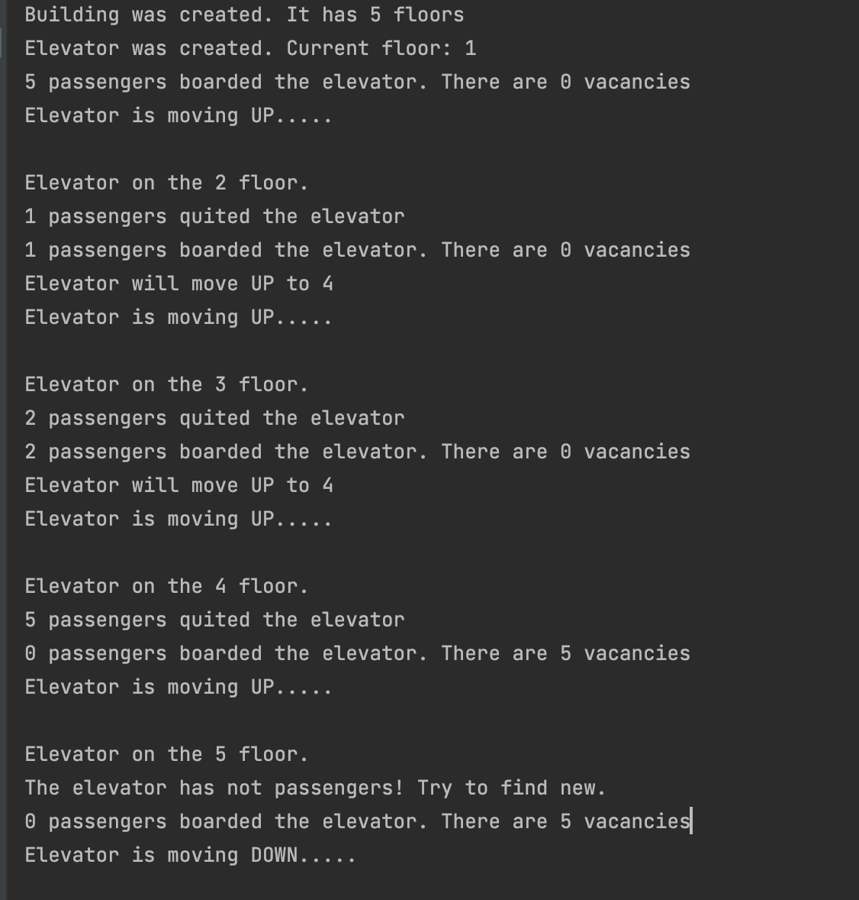

# TheElevator
***
Application simulates work of an elevator in a building.
- Quantity of floors and passengers on each floor generates randomly at program start.
- Range of floors is between 2 and 20
- Range of passengers on each floor is between 0 and 10
- Maximal elevator capacity is 5 passengers.
***
## How to start
Run from Main class

## Screenshot of console:

